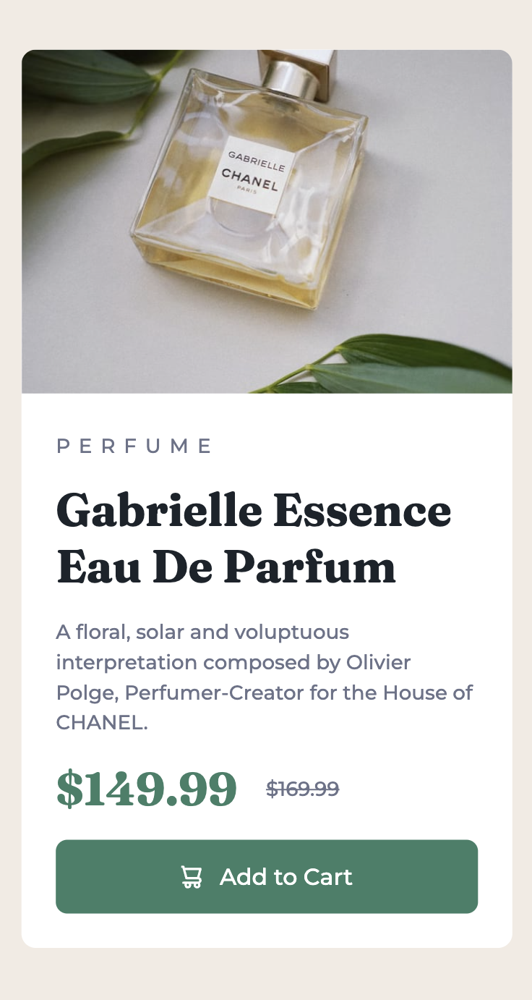

# Frontend Mentor - Product preview card component solution

This is a solution to the [Product preview card component challenge on Frontend Mentor](https://www.frontendmentor.io/challenges/product-preview-card-component-GO7UmttRfa). Frontend Mentor challenges help you improve your coding skills by building realistic projects. 

## Table of contents

- [Overview](#overview)
  - [The challenge](#the-challenge)
  - [Screenshot](#screenshot)
  - [Links](#links)
- [My process](#my-process)
  - [Built with](#built-with)
  - [What I learned](#what-i-learned)
  - [Continued development](#continued-development)
  - [Useful resources](#useful-resources)
- [Author](#author)
- [Acknowledgments](#acknowledgments)

## Overview

### The challenge

Users should be able to:

- View the optimal layout depending on their device's screen size
- See hover and focus states for interactive elements

### Screenshot

### Links

- Solution URL: [My solution](https://www.frontendmentor.io/solutions/responsive-product-preview-card-component-with-html-css-lhOcSHQbsK)
- Live Site URL: [Website](https://profound-kashata-71f155.netlify.app/)

## My process

### Built with

- Semantic HTML5 markup
- CSS custom properties
- Flexbox
- CSS Grid
- Mobile-first workflow

### What I learned

I haven't made a frontend web project in a few months, so it was very interesting finding my way back to web programming. I'm very proud of myself and how fast I actually finished this project.

### Continued development

I want to try and better my accessibility on this project and also how to write a bit less CSS code that is effective.

### Useful resources

- [Kevin Powell](https://www.youtube.com/@KevinPowell) - His channel helped me out so much with getting back to CSS. It was a blast

## Author

- Website - [Carolina Semeao](https://www.your-site.com)
- Frontend Mentor - [@carolsemeao](https://www.frontendmentor.io/profile/carolsemeao)
- Twitter - [@twiddyTV](https://www.twitter.com/twiddyTV)

## Acknowledgments

I have gotten my inspiration to start this project from Kevin Powell on Youtube. His solution was incredible but I tried to do my own custom CSS and not copy his work. My goal was to try things myself with little help from anyone, except my own knowledge.
